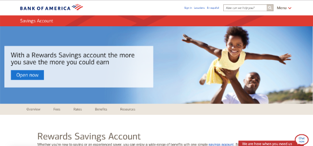

# FinTech Focus: Materialize Layout Practice

## The Goal
Now that you know one of the tools used by professionals, it's time to take on a professional website challenge! In this lab, your job will be to use the materialize tools you've learned to recreate a webpage from the website of the financial services firm that is hosting you for the summer.

### Getting Started

1. Clone this repository using `git clone`
2. Open the file `index.html` and preview it. You won't see much here yet!

## The Lab
You will be using Materialize's Grid and Components to replicate the website of your host financial services firm. Because we'll just be using HTML and CSS, none of the interactive pieces will actually work -- you can think of this as a non-functional replica of the page. Focus on the layout pieces first -- smaller details can be added later. We suggest you start with the nav bar and work your way down the page! Please note: you must replicate the assigned page of the firm that is hosting you this summer. 

### Bank of America
If Bank of America is hosting you this summer, you'll be building the <a href="https://www.bankofamerica.com/deposits/savings/savings-accounts/">Savings Account Page</a>.

### Goldman Sachs
If Goldman Sachs is hosting you this summer, you'll be building the <a href="https://www.goldmansachs.com/our-firm/index.html">Our Firm Page</a>.

### JP Morgan Chase
If JP Morgan Chase is hosting you this summer, you'll be building the <a href="https://www.jpmorgan.com/country/US/EN/solutions">Solutions Page</a>.

### Morgan Stanley
If Morgan Stanley is hosting you this summer, you'll be building the <a href="https://www.morganstanley.com/about-us">About Us Page</a>.

### Wells Fargo
If Wells Fargo is hosting you this summer, you'll be building the <a href="https://www.wellsfargo.com/about">About Wells Fargo Page</a>.

